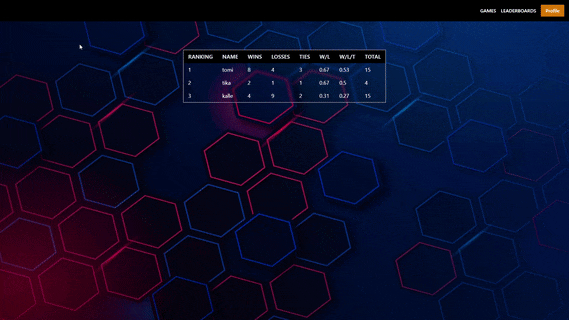

<h1 align="center">
  <br>
  Tic-Tac-Toe-Online
  <br>
</h1>

<h4 align="center">This project features both online and offline gameplay options, allowing you to play against friends or the computer. The game is built using modern web technologies and is fully responsive, making it easy to play on any device. <a href="https://nodejs.org/en" target="_blank">Node.js</a>, <a href="https://react.dev/" target="_blank">React</a> <a href="https://socket.io/" target="_blank">Socket.io</a> and <a href="https://tailwindcss.com/" target="_blank">Tailwind</a>.</h4>

<p align="center">
  <a href="#key-features">Key Features</a> •
  <a href="#limitations">Limitations</a> •
  <a href="#how-to-use">How To Use</a> •
  <a href="#credits">Credits</a> •
  <a href="#description">Description</a> •
  <a href="#features">New Features</a> •
  <a href="#license">License</a>
</p>

<p align="center">
 
</p>

## Key Features

- Online Multiplayer Support
- Realtime updates and gameplay
- Display number connected players in a game
- Play offline agains "Ai"
- Leaderboard
- Customizable gridsize
- Create, Join, Delete Games
- Quick Rematch Functionality
- Replay Old Games
- Custom DataDrid component
- Custom Grid Component

## limitations

- Offline games are not saved
- There might be some bugs with the socket connections, and lacks any manual refresh functionality
- Lacks proper handling of errors

## How To Use

> **Note**
> For Windows only

```bash
To be updated

# Clone this repository
$ git clone https://github.com/tomppatomppa/tictactoe-online.git

```

## Description

This repository aims to help me familiarize myself with the basics of WebSocket technologies, such as sockets.io. To achieve this, I implemented a real-time gaming functionality in a tic-tac-toe game.

The client features custom React components that can be reused throughout the app.

## DataGrid Component

My goal was to create some kind of "gamelobby" that receives updates in realtime, and has an "action" button that can be customized based on the data that exists in the grid.

Lets say we received an array of game items:

```ruby
const gameArray = [ {"id": 1, "player1": 1, "player2": 2 }, {..etc}]

const headers= {
    id: "id",
    player1: "player1"
    player2: "player2"
}

<DataGrid headers={headers}, data={gameArray} />

Expected output:

|id|player1|player2|
| 1|      1|      2|

```

Lets say i want to add a button "MyGame" for all games where player1 == 1.

I would have to pass two extra props, entity and onClick.

```ruby

const headers= {
    id: "id",
    player1: "player1"
    player2: "player2"
}

const playButton = {
  target: ['player1'], //target a field in the headers
  match: [1],          //specify what value is a valid match
  text: 'MyGame',      //button text
  dispatch: ['id'],    //what value to dispatch when clicked
  type: 'mygame',      //specify a type, can be whatever
  style: buttonStyle,  //custom style for button
}

const mybuttons = [playButton, ...]

<DataGrid headers={headers}, data={gameArray} entity={myButtons} onClick={onClickFunction} />

Expected output:

|id|player1|player2|   action|
| 1|      1|      2| MyButton|


```

OnClick would dispatch {type: "mygame", data: {id:1} as specified in the playButton object.

## Features to be implemented

- Support for different games
- Show online players outside of a gameRoom
- Improve DataGrid with filtering, challenge users etc..
- 3D GridTiles

## Credits

This software uses the following open source packages:

- [Node.js](https://nodejs.org/en)
- [React](https://react.dev/)
- [Express](https://expressjs.com/)
- [Socket.io](https://socket.io/)
- [Tailwind](https://tailwindcss.com/)

## Live Website

[tic-tac-toe-online](https://tictactoe-online.fly.dev/) - A Working Version Hosted On Fly.io

## License

MIT

---

> GitHub [@tomppatomppa](https://github.com/tomppatomppa) &nbsp;&middot;&nbsp;
